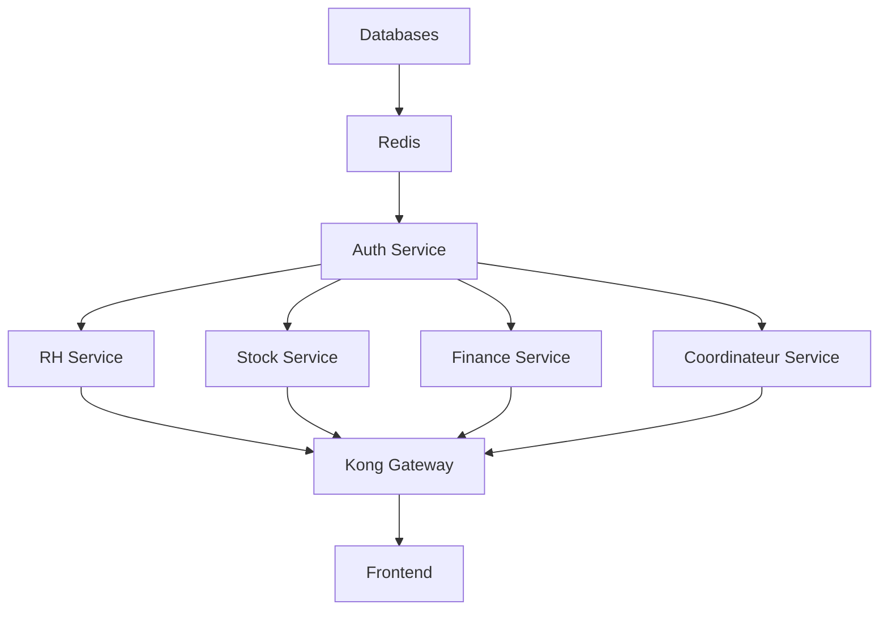

# 🔧 Intégration Frontend dans votre Stack Docker Compose v3.9

## ✅ Configuration Compatible

Votre frontend React + Vite est maintenant prêt à être intégré dans votre architecture microservices avec Kong Gateway.

## 📝 Modification Requise dans votre docker-compose.yml

**Remplacez la section `frontend` actuelle par :**

```yaml
  # =====================
  # FRONTEND REACT + VITE
  # =====================
  frontend:
    build:
      context: ./Frontend
      dockerfile: Dockerfile
    container_name: frontend
    ports:
      - "3000:3000"
    environment:
      - VITE_API_URL=http://kong:8000  # ✅ Connexion via Kong Gateway
    depends_on:
      - kong
    restart: unless-stopped
    networks:
      - project_network
```

## 🔑 Changement Clé

**Ajoutez simplement la variable d'environnement :**
```yaml
environment:
  - VITE_API_URL=http://kong:8000
```

Cette variable configure le frontend pour communiquer avec tous vos microservices via Kong Gateway (port 8000).

## 🛠️ Mode Développement (Optionnel)

Pour le développement avec hot-reload, ajoutez ce service additionnel :

```yaml
  frontend_dev:
    build:
      context: ./Frontend
      dockerfile: Dockerfile.dev
    container_name: frontend_dev
    ports:
      - "5173:5173"
    environment:
      - VITE_API_URL=http://kong:8000
    volumes:
      - ./Frontend:/app
      - /app/node_modules
    depends_on:
      - kong
    restart: unless-stopped
    networks:
      - project_network
```

## 📋 Structure du Projet Attendue

```
votre-projet/
├── auth_service/
├── rh_service/
├── stock_service/
├── coordinateur_service/
├── finance_service/
├── notification_service/
├── Frontend/                    # ← Nom du dossier
│   ├── Dockerfile              # ← Build de production
│   ├── Dockerfile.dev          # ← Build de développement
│   ├── nginx.conf
│   ├── docker-entrypoint.sh
│   ├── package.json
│   ├── vite.config.ts
│   └── src/
├── kong/
│   └── kong.yml
└── docker-compose.yml
```

## 🚀 Commandes de Déploiement

### 1. Build Tous les Services

```bash
docker-compose build
```

### 2. Démarrer le Stack Complet

```bash
docker-compose up -d
```

### 3. Vérifier le Frontend

```bash
# Vérifier les logs
docker-compose logs -f frontend

# Tester l'endpoint health
curl http://localhost:3000/health
# Devrait retourner: "healthy"

# Tester l'application
curl -I http://localhost:3000
# Devrait retourner: HTTP/1.1 200 OK
```

### 4. Vérifier la Connectivité avec Kong

```bash
# Depuis le container frontend
docker exec frontend wget -O- http://kong:8000/api/auth/

# Ou tester depuis l'hôte
curl http://localhost:8000/api/auth/
```

## 🔍 Vérification de la Configuration

### Test Complet de la Chaîne

```bash
# 1. Kong est accessible
curl http://localhost:8000/

# 2. Auth service via Kong
curl http://localhost:8000/api/auth/

# 3. Stock service via Kong
curl http://localhost:8000/api/stock/

# 4. Frontend est accessible
curl http://localhost:3000/

# 5. Frontend peut joindre Kong (depuis l'intérieur du container)
docker exec frontend wget -qO- http://kong:8000/api/auth/
```

## 📊 Ordre de Démarrage



L'ordre des dépendances est respecté par les `depends_on` dans votre docker-compose.yml.

## 🐛 Résolution de Problèmes

### Frontend ne démarre pas

```bash
# Vérifier les logs
docker-compose logs frontend

# Rebuild si nécessaire
docker-compose up -d --build frontend
```

### Erreur "Cannot connect to Kong"

```bash
# Vérifier que Kong est démarré
docker-compose ps kong

# Vérifier la configuration réseau
docker network inspect votre-projet_project_network

# Tester la connectivité
docker exec frontend ping kong
```

### Variables d'environnement non prises en compte

```bash
# Vérifier la config injectée
docker exec frontend cat /usr/share/nginx/html/config.js

# Devrait afficher:
# window.ENV = {
#     VITE_API_URL: 'http://kong:8000'
# };
```

## 📈 Recommandations de Production

1. **Ajouter des Health Checks**
   ```yaml
   healthcheck:
     test: ["CMD-SHELL", "wget -q --spider http://localhost:3000/health || exit 1"]
     interval: 30s
     timeout: 10s
     retries: 3
     start_period: 40s
   ```

2. **Limiter les Ressources**
   ```yaml
   deploy:
     resources:
       limits:
         cpus: '0.5'
         memory: 512M
       reservations:
         cpus: '0.25'
         memory: 256M
   ```

3. **Configurer les Logs**
   ```yaml
   logging:
     driver: "json-file"
     options:
       max-size: "10m"
       max-file: "3"
   ```

## ✅ Checklist de Déploiement

- [ ] Dockerfile et Dockerfile.dev créés dans ./Frontend
- [ ] nginx.conf créé dans ./Frontend
- [ ] docker-entrypoint.sh créé dans ./Frontend (chmod +x)
- [ ] docker-compose.yml modifié avec la bonne configuration
- [ ] Variable `VITE_API_URL` correctement définie
- [ ] Kong configuré avec les bonnes routes
- [ ] Build réussi: `docker-compose build frontend`
- [ ] Démarrage réussi: `docker-compose up -d frontend`
- [ ] Health check OK: `curl http://localhost:3000/health`
- [ ] Application accessible: `curl http://localhost:3000`
- [ ] API accessible via Kong: Frontend peut joindre http://kong:8000
